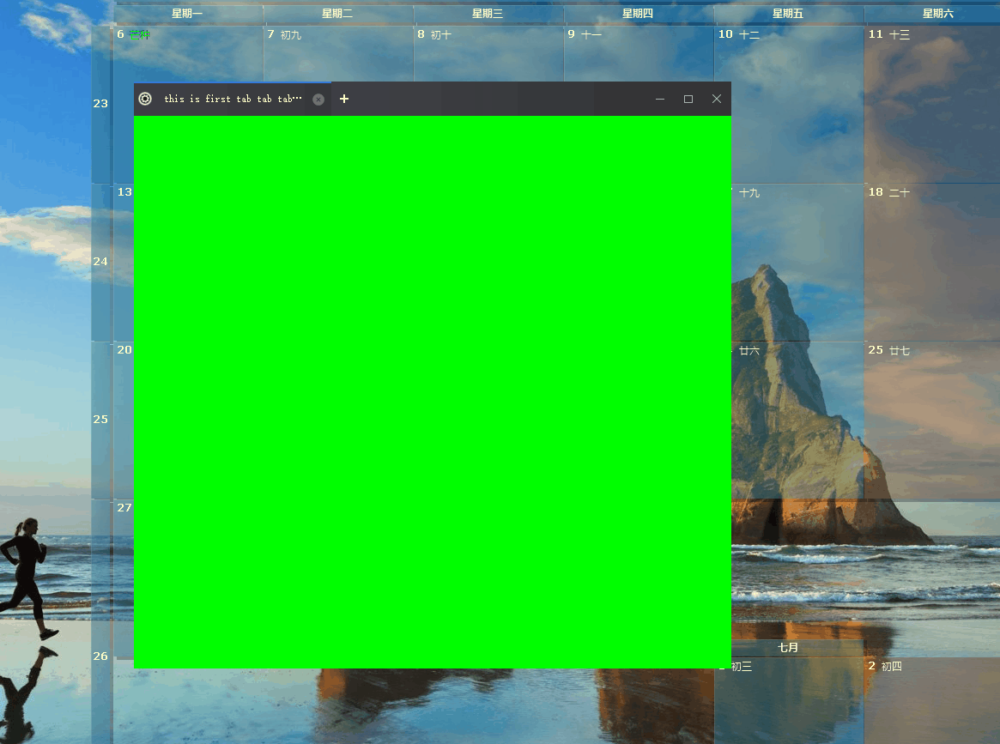

# QtExtTabWidget
### 1.效果展示 

 

### 2.用法展示

我已经将绘制接口独立出来，如果你想要绘制自己的特色，只需要继承`BaseTabBarDrawHelper`实现里面的接口，再调用`QTabWidgetProxy::updateDrawHelp()`函数，传递自定义的class。

这里还存在个问题就是多次调用`QTabWidgetProxy::updateDrawHelp()`有内存泄漏的风险。所以这个bug，已经解决了方案我准备将项目升级到vs2019使用智能指针管理内存。

```c++
MainWindow::MainWindow(QWidget *parent)
    : QMainWindow(parent), ui(new Ui::MainWindow) {
  ui->setupUi(this);
  setupUI();
}

MainWindow::~MainWindow() {
  delete ui;
  delete frame_less_helper_;
}

void MainWindow::setupUI() {
  this->setWindowFlags(Qt::FramelessWindowHint |
                       Qt::X11BypassWindowManagerHint);
  frame_less_helper_ = new NcFramelessHelper();
  frame_less_helper_->activateOn(this);
  frame_less_helper_->setFilterEventCallBack(
      std::bind(&TabWidgetProxy::filterTabBarEvent, ui->tabWidgetProxy,
                std::placeholders::_1, std::placeholders::_2));
  frame_less_helper_->activeOnWithChildWidget(this,
                                              ui->tabWidgetProxy->tabBar());

  connect(&(ui->tabWidgetProxy->getSignal()), SIGNAL(tabInserted(int)), this,
          SLOT(OnTabInserted(int)));
  connect(&(ui->tabWidgetProxy->getSignal()), SIGNAL(addBtnClicked()), this,
          SLOT(OnAddBtnClicked()));
  connect(&(ui->tabWidgetProxy->getSignal()), SIGNAL(tabClosed(int)), this,
          SLOT(OnCloseTab(int)));
  connect(&(ui->tabWidgetProxy->getSignal()), SIGNAL(closeWnd()), this,
          SLOT(OnCloseWnd()));
  connect(&(ui->tabWidgetProxy->getSignal()), SIGNAL(minWnd()), this,
          SLOT(OnMinWnd()));
  connect(&(ui->tabWidgetProxy->getSignal()), SIGNAL(maxWnd()), this,
          SLOT(OnMaxWnd()));
  connect(&(ui->tabWidgetProxy->getSignal()), SIGNAL(restoreWnd()), this,
          SLOT(OnRestoreWnd()));
  connect(&(ui->tabWidgetProxy->getSignal()), SIGNAL(tabBarDoubleClicked()),
          this, SLOT(OnMaxOrRestore()));

  ui->tabWidgetProxy->updateDrawHelp(new TabBarDrawHelper());

#ifdef _DEBUG
  QWidget *widget = new QWidget();
  widget->setStyleSheet("background-color:#FF00FF00");
  ui->tabWidgetProxy->addTab2(widget, tr("this is first tab tab tab tab tab"));
#endif  //_DEBUG

}

void MainWindow::OnTabInserted(int index) {
  QPushButton *button = new QPushButton();
  button->setStyleSheet(
      "QPushButton{border-image: url(:/images/close.png)}"
      "QPushButton:hover{border-image: url(:/images/close_hover.png)}");
  ui->tabWidgetProxy->setTabButton2(index, QTabBar::RightSide, button);
  ui->tabWidgetProxy->setTabIcon(index, QIcon(":/images/x-capture-options.png"));
}

void MainWindow::OnCloseTab(int index) {
  // todo something
}

void MainWindow::OnAddBtnClicked() {
  QWidget *widget = new QWidget();
  widget->setStyleSheet("background-color:#FFFFFF00");
  ui->tabWidgetProxy->addTab2(widget, tr("this is first tab"));
}

void MainWindow::OnCloseWnd() { this->close(); }

void MainWindow::OnMinWnd() {}

void MainWindow::OnMaxWnd() {}

void MainWindow::OnRestoreWnd() {}

void MainWindow::OnMaxOrRestore() {}

// 下面是具体的绘制过程
#include <QFont>
#include "draw_helper.h"
#include "round_shadow_helper.h"
#include "tab_bar_draw_helper.h"

TabBarDrawHelper::TabBarDrawHelper() {
  tab_bar_bk_image_.load(":/images/default_100_precent/caption_bg.png");
  tab_bk_normal_image_.load(":/images/default_100_precent/tab.png");
  tab_bk_hover_image_.load(":/images/default_100_precent/tab_hover.png");
  tab_bk_selected_image_.load(":/images/default_100_precent/tab_check.png");

  left_arrow_pixmap_list_.push_back(
      QPixmap(":/images/default_100_precent/left_arrow_normal.png"));
  left_arrow_pixmap_list_.push_back(
      QPixmap(":/images/default_100_precent/left_arrow_disabled.png"));

  right_arrow_pixmap_list_.push_back(
      QPixmap(":/images/default_100_precent/right_arrow_normal.png"));
  right_arrow_pixmap_list_.push_back(
      QPixmap(":/images/default_100_precent/right_arrow_disabled.png"));
}

TabBarDrawHelper::~TabBarDrawHelper() {}

void TabBarDrawHelper::paintTabAddBtn(QPainter &painter, const QRect &rect,
                                      TabState tab_state) {
  QColor color = (TabState::hover_ == tab_state) ? QColor(255, 255, 255, 50)
                                                 : Qt::transparent;
  painter.save();
  QRect draw_rect = QRect(QPoint(0, 0), QSize(20, 20));
  draw_rect.moveCenter(rect.center());
  DrawCircle::Draw(&painter, draw_rect, color);
  DrawCharacter::DrawPlus(&painter, draw_rect, Qt::white);
  painter.restore();
}

void TabBarDrawHelper::paintTab(QPainter &painter, const QRect &draw_rect,
                                TabState tab_state, const QString &text,
                                const QIcon &icon) {
  painter.save();
  painter.setPen(Qt::NoPen);
  painter.setRenderHint(QPainter::SmoothPixmapTransform);
  if (TabState::selected_ == tab_state) {
    if (!tab_bk_selected_image_.isNull())
      painter.drawPixmap(draw_rect, tab_bk_selected_image_);
  } else if (TabState::hover_ == tab_state) {
    if (!tab_bk_hover_image_.isNull())
      painter.drawPixmap(draw_rect, tab_bk_hover_image_);
  } else if (TabState::normal_ == tab_state) {
    if (!tab_bk_normal_image_.isNull())
      painter.drawPixmap(draw_rect, tab_bk_normal_image_);
  }
  QRect real_rect = draw_rect;
  real_rect -= QMargins(35, 0, 30, 0);
  painter.setPen(Qt::white);
  QString draw_text =
      painter.fontMetrics().elidedText(text, Qt::ElideRight, real_rect.width(), 0);
  painter.drawText(real_rect, Qt::AlignLeft | Qt::AlignVCenter, draw_text);
  painter.restore();
  // draw tab icon
  if (!icon.isNull()) {
    painter.save();
    painter.setPen(Qt::NoPen);
    QList<QSize> actual_size = icon.availableSizes();
    QSize icon_size = actual_size[0];
    QPoint icon_point = QPoint(draw_rect.left() + 5,
                               (draw_rect.height() - icon_size.height()) / 2);
    QRect icon_rect(icon_point, icon_size);
    painter.drawPixmap(icon_rect, icon.pixmap(icon_size));
    painter.restore();
  }
}

void TabBarDrawHelper::paintTabBar(QPainter &painter, const QRect &rect) {
  if (tab_bar_bk_image_.isNull()) return;
  painter.save();
  painter.drawPixmap(rect, tab_bar_bk_image_);
  painter.restore();
}

void TabBarDrawHelper::paintScrollBtn(bool left, QPainter &painter,
                                      const QRect &rect,
                                      const QToolButton *tool_btn) {
  QBrush rect_brush = Qt::transparent;
  if (tool_btn->underMouse()) {
    rect_brush = QColor(214, 214, 214, 100);
  }

  QRect draw_rect = QRect(0, 0, 20, 20);
  draw_rect.moveCenter(rect.center());
  RoundShadowHelper round_helper;
  round_helper.FillRoundShadow(&painter, draw_rect, rect_brush.color(), 4);

  draw_rect = QRect(0, 0, 16, 16);
  draw_rect.moveCenter(rect.center());
  painter.save();
  if (!tool_btn->isEnabled()) {
    // disabled
    painter.drawPixmap(draw_rect, left ? left_arrow_pixmap_list_[1]
                                       : right_arrow_pixmap_list_[1]);
  } else {
    // normal
    painter.drawPixmap(draw_rect, left ? left_arrow_pixmap_list_[0]
                                       : right_arrow_pixmap_list_[0]);
  }

  painter.restore();
}

QRect TabBarDrawHelper::calcIconBtnRect(bool left_button,
                                        const QSize &icon_size,
                                        const QRect &btn_rect) {
  QPoint center_pos = QPoint(0, 0);
  QRect button_rect = QRect(0, 0, 0, 0);
  const int icon_padding = 8;
  if (left_button) {
    center_pos =
        QPoint(icon_padding + icon_size.width() / 2 + btn_rect.x(),
               btn_rect.y() + (btn_rect.height() - icon_size.height()) / 2 +
                   icon_size.height() / 2);
  } else {
    center_pos = QPoint(
        btn_rect.x() + btn_rect.width() - icon_padding - icon_size.width() / 2,
        btn_rect.y() + (btn_rect.height() - icon_size.height()) / 2 +
            icon_size.height() / 2);
  }
  button_rect = QRect(QPoint(0, 0), icon_size);
  button_rect.moveCenter(center_pos);
  return button_rect;
}
```

### 3.特性配置

- 增加无边框窗口功能（缩放，移动）
- 增加tab贴图功能
- 双击关闭tab
- 可以设置是否需要绘制“+”按钮。
- 支持tab拖拽，合并
- 将绘制接口导出来，方便用户自定义绘制和贴图

### 4.总结

没写之前觉得是个小功能，真正写的过程中，也是遇到了很多奇奇怪怪的问题，也是阅读了Qt源码才解决了问题。还是自己动手才知道其中的难点。

虽然很早就写得差不多了，一直在重构。但是总觉得还有很多地方没有处理好。

比如：

- 上面的提到的TabBarDrawHelper内存管理一直在裸奔。
- 整体结构并没有画出来，准备后续的文档在整理了。
- 真正用到项目中估计还有其他问题，还需要在整理。
- ...

这大概就是有点完美强迫症吧，但是这复工没多久实在是太忙了，所以就先这样吧，实在是干不动了，^-^。

最好还是要谢谢这位同学，项目里面用到的拖拽和合并的功能完全参考这位同学的。地址：https://github.com/iwxyi/Qt-DragableTabWidget


地址：https://github.com/MingYueRuYa/QtExtTabWidget

